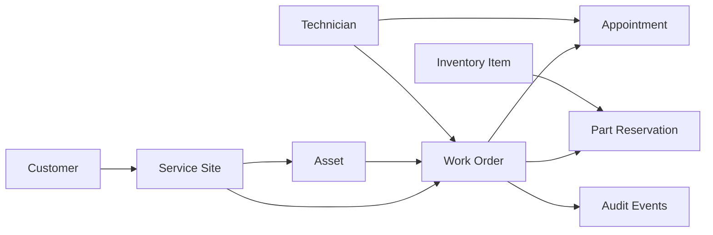

# Service Operations Platform

A Java/Spring Boot backend for managing customers, service locations, field assets, work orders, technician scheduling, and parts inventory in one operational workflow.

The project is designed around a common service-operations problem: a team needs to know **what is installed, what needs attention, who is assigned, when the work is scheduled, and whether the required parts are actually available**.

## What it demonstrates

- Java 21 and Spring Boot application design
- REST API design with request validation and RFC-style problem responses
- Spring Data JPA / Hibernate with relational domain modeling
- Transactional work-order and inventory workflows
- Optimistic locking for concurrent inventory updates
- Time-zone-aware technician scheduling and overlap detection
- Internationalized reference data using `Accept-Language`
- PostgreSQL schema management with Flyway
- H2 zero-setup development profile
- Docker / Docker Compose
- OpenAPI / Swagger documentation
- Unit and Spring integration tests
- GitHub Actions CI

## Core workflow



A work order can be created for a site or specific asset, assigned to a technician, scheduled in the site's time zone, supplied with reserved inventory, moved through a controlled lifecycle, and completed with parts consumption and an audit trail.

## Domain behavior

### Work-order lifecycle

```text
OPEN -> ASSIGNED -> IN_PROGRESS -> COMPLETED
  |         |             |
  |         +----> WAITING_PARTS ----+
  +-------------------------------> CANCELLED
```

Invalid state transitions return `409 Conflict` rather than silently changing state.

### Inventory reservation

`InventoryItem` tracks on-hand and reserved quantities separately. Reserving a part reduces **available** quantity but does not reduce on-hand inventory until the work order is completed. Cancelling a work order releases any outstanding reservations.

Inventory rows use JPA `@Version` optimistic locking so concurrent reservations cannot silently overwrite one another.

### Scheduling and time zones

Appointments are submitted as local times plus an IANA time-zone name such as `America/Denver`. The service stores UTC instants and returns both UTC and localized display values. Overlapping appointments for the same technician are rejected.

## Quick start: zero-setup demo

The default profile uses an in-memory H2 database and loads a small demo dataset.

```bash
./mvnw spring-boot:run
```

Then open:

- Swagger UI: `http://localhost:8080/swagger-ui.html`
- Health: `http://localhost:8080/actuator/health`
- Dashboard: `http://localhost:8080/api/dashboard`

## PostgreSQL / Docker

Run the full application and PostgreSQL together:

```bash
docker compose up --build
```

The Docker profile runs Flyway migrations and enables demo data for a ready-to-explore environment.

## Example API flow

Create a work order:

```http
POST /api/work-orders
Content-Type: application/json

{
  "siteId": "<site-id>",
  "assetId": "<asset-id>",
  "summary": "Investigate intermittent airflow alert",
  "description": "The third-floor zone is reporting inconsistent airflow.",
  "priority": "HIGH"
}
```

Reserve a required part:

```http
POST /api/work-orders/<work-order-id>/parts
Content-Type: application/json

{
  "inventoryItemId": "<inventory-item-id>",
  "quantity": 1
}
```

Schedule a technician using the site's configured time zone:

```http
POST /api/work-orders/<work-order-id>/appointments
Content-Type: application/json

{
  "technicianId": "<technician-id>",
  "startLocal": "2026-09-20T09:00:00",
  "endLocal": "2026-09-20T11:00:00"
}
```

Complete the work order:

```http
POST /api/work-orders/<work-order-id>/completion
Content-Type: application/json

{
  "resolutionNotes": "Replaced the failed relay and verified normal operation."
}
```

## API surface

| Area | Endpoints |
| --- | --- |
| Customers | create/list customers; create/list customer sites |
| Assets | create/list assets at a service site |
| Technicians | create/list technicians and skills |
| Inventory | create/list items and receive stock |
| Work orders | create/list/detail, assignment, state transitions, parts, appointments, completion |
| Operations | dashboard counts and low-stock visibility |
| Reference data | localized work-order status labels |

See [`docs/API_EXAMPLES.md`](docs/API_EXAMPLES.md) for a longer walkthrough.

## Project structure

```text
src/main/java/com/yaseenmahdi/serviceops/
├── api/          REST controllers and DTOs
├── config/       OpenAPI and demo-data configuration
├── domain/       JPA entities and business invariants
├── exception/    API error handling
├── repository/   Spring Data repositories
└── service/      transactional application services
```

## Testing

```bash
./mvnw verify
```

The test suite covers domain invariants plus persistence-backed work-order, inventory, scheduling, and time-zone behavior.

## Engineering notes

- The public demo intentionally omits authentication so the repository stays focused on workflow and integration architecture. A production deployment would place the API behind OIDC/JWT authentication and role-based authorization.
- External messaging, billing, and vendor adapters are left behind service boundaries rather than hard-coded into the domain model.
- H2 is for quick local evaluation; PostgreSQL is the production-style persistence target.

More detail is available in:

- [`docs/ARCHITECTURE.md`](docs/ARCHITECTURE.md)
- [`docs/DESIGN_DECISIONS.md`](docs/DESIGN_DECISIONS.md)
- [`docs/API_EXAMPLES.md`](docs/API_EXAMPLES.md)
 
