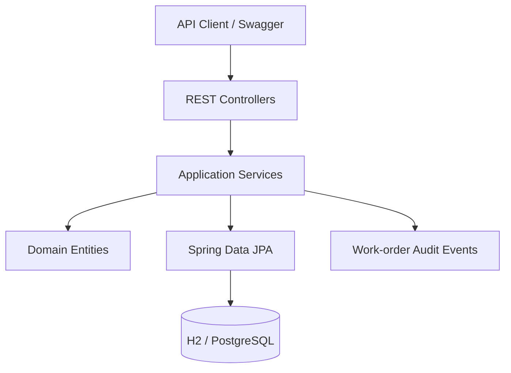

# Architecture

## Overview

The application uses a conventional layered Spring architecture with domain behavior kept inside entities where the invariant belongs and cross-aggregate workflows coordinated by transactional services.

## Main aggregates

- **Customer / ServiceSite / Asset** — identifies who is being served, where the work happens, and what physical asset is involved.
- **WorkOrder** — owns lifecycle state and assignment rules.
- **InventoryItem / WorkOrderPart** — separates stock availability from reservation and final consumption.
- **Appointment** — stores UTC instants while retaining the source IANA time zone used for scheduling.
- **WorkOrderEvent** — provides an append-only operational trail for important workflow actions.

## Transaction boundaries

`WorkOrderService` coordinates operations that must succeed or fail together. Examples include reserving inventory for a work order, releasing reservations during cancellation, and consuming reserved parts during completion.

## Concurrency

Inventory items and work orders include JPA version columns. If two transactions update the same row from stale versions, the second update fails instead of silently overwriting the first. This is preferable to coarse database locking for the expected service-operations workload.

## Persistence profiles

The default profile uses H2 for a fast local demo. The `postgres` profile uses PostgreSQL and Flyway with Hibernate schema validation.
